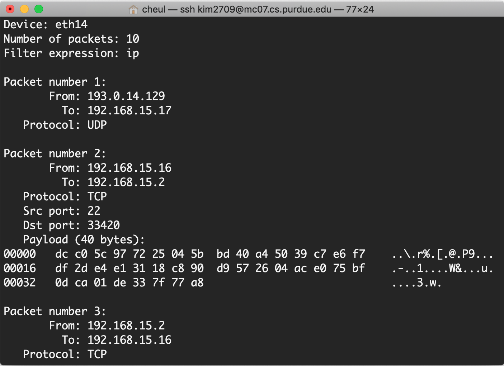
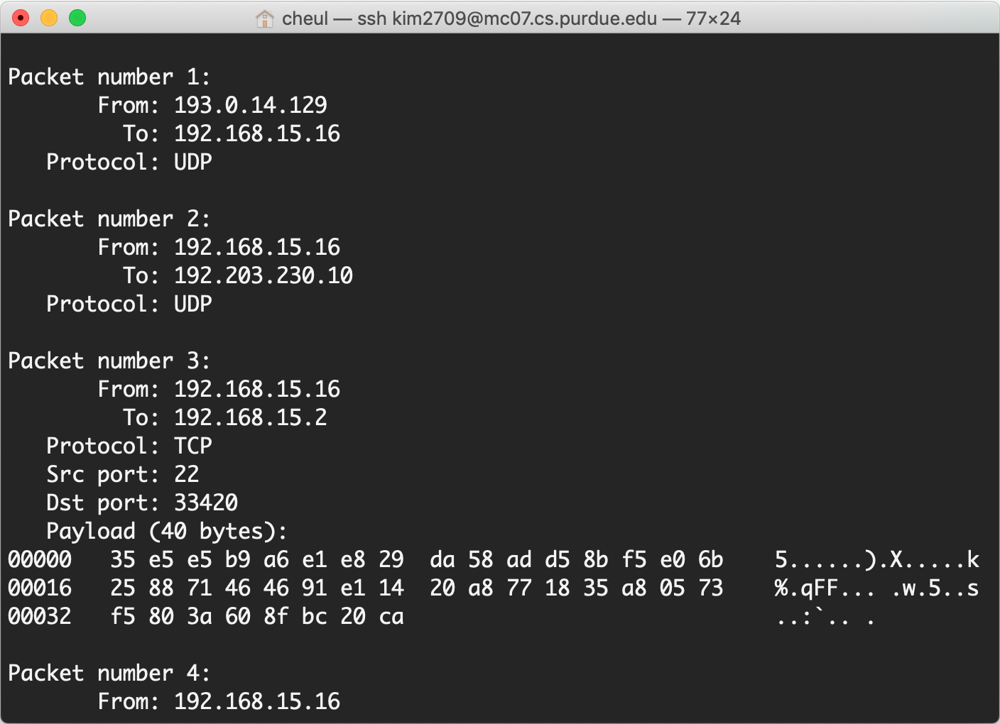

### Task1.a: Understanding

1. Problem 1: Please use your own words to describe the sequence of the library calls that are essential for sniffer programs. This is meant to be a summary, not detailed explanation like the one in the tutorial.
	- pcap_lookupdev(): find a device on which to capture
	- pcap_lookupnet(): find the network number and netmask for the deivce
	- pcap_open_live(): open the deive for sniffing/capturing (obtain a packet capture handle to look at packets on the network)
	- pcap_datalink(): get the link-layer header type. For this program, make sure we're capturing an Ethernet device
	- pcap_compile(): compile a filter expression
	- pcap_setfilter(): apply/set the filter
	- pcap_loop(): process packets until the count of packets runs out
	- pcap_freecode(): free up allocated memory pointed by a bpf_program struct
	- pcap_close(): close the capture device

2. Problem 2: Why do you need the root privilege to run sniffex? Where does the program fail if executed without the root privilege?
	- Access models in Linux are implemented in the OS when it comes to accessing devices, files, and other sevices provided by the OS. pcap_lookupdev(), for example, requires low-level access to a network interface. Due to security implications such as capturing network traffic, generating arbitary packets etc, such access is limited to privileged users only. Thus, you cannot run the above code without the root privilege. 
 
```c
// The program fails to find the default device on which to capture if executed without no root privilege
dev = pcap_lookupdev(errbuf);
if (dev == NULL) {
	fprintf(stderr, "Couldn't find default device: %s\n", errbuf);
	exit(EXIT_FAILURE);
}
```


3. Problem 3: Please turn on and turn off the promiscuous mode in the sniffer program. Can you demonstrate the difference when this mode is on and off? Please describe how you demonstrate this.
	- The sniffing program in the promiscuous mode sniffs all traffic on the wire while in the non-promiscuous mode the program sniffs only traffic directly related to it (that is, only traffic to, from, or routed through the host will be observed)
	- Promiscuous mode: pcap_open_live(dev, SNAP_LEN, 1, 1000, errbuf);
	- Non-promiscuous mode: handle = pcap_open_live(dev, SNAP_LEN, 0, 1000, errbuf);
	- If you'd like to run your sniff program in promiscuous mode, then set 1 to the third argument in "pcap_open_live". Otherwise 0 to it for non-promiscuous mode

- Here is an example showing the difference between sniffing in promisc mode and in non-promisc mode. The host IP is 192.168.15.16
- Below image is a result in Promiscuous mode. You can see traffic not related to the host such as a packet from 193.0.14.129 to 192.168.15.17
<div style="text-align:center"></div>

<br />

- Below image is a result in Non-Promiscuous mode. You cannot see any traffic nothing to do with the host



### Task1.b: Wriiting Filters

1. Capture the ICMP packets between two specific hosts

2. Capture the TCP packets that have a destination port range from to port 50-100
