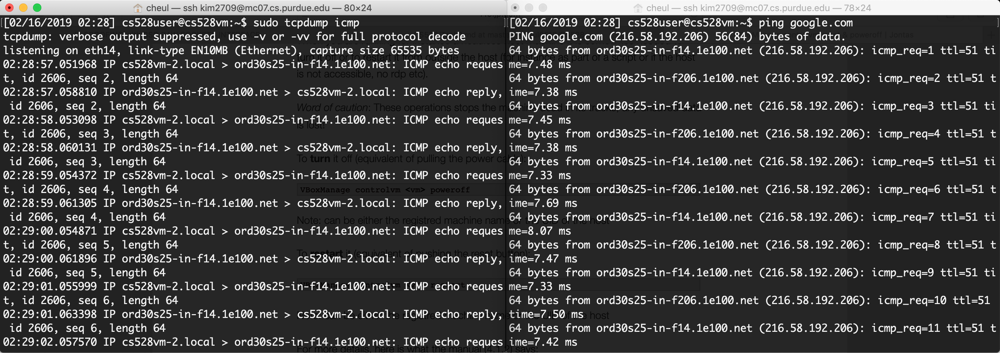

### Task2: Spoofing
#### Task2.a Write a spoofing program
- Write your own packet spoofing program. Using this program to perform the following tasks. You will need to submit this program along with your report

#### Task2.b Spoof an ICMP Echo Request
- Spoof an ICMP echo request packet on behalf of another machine (i.e., using another machine's IP address as its source IP address). This packet should be sent to a remote machine on the Internet (the machine must be alive)
- I have two virtual machines run at a time. Let one VM pings google.com while another VM spoofs ICMP echo requests
- Below is the result of spoofing ICMP echo requests and replies, followed by the spoofing code
 

```c
/* 
 * Reference: http://www.enderunix.org/docs/en/rawipspoof/
 * I'm going to create my ICMP packet, which is type echo-request,
 * and hand it over to the raw sockets API to deliver it to the network
 */
#include <stdio.h>
#include <stdlib.h>
#include <unistd.h>
#include <string.h>
#include <netdb.h>

#include <sys/types.h>
#include <sys/stat.h>
#include <sys/socket.h>

#include <netinet/in_systm.h>
#include <netinet/in.h>
#include <netinet/ip.h>
#include <netinet/udp.h>
#include <netinet/ip_icmp.h>
#include <netinet/tcp.h>

#include <arpa/inet.h>

// Internet checksum function. This function is used for calculating checksum for ICMP protocol
unsigned short chksum(unsigned short *addr, int len){
 int nleft = len;
 int sum = 0;
 unsigned short *w = addr;
 unsigned short answer = 0;
 
 while (nleft > 1){
  sum += *w++;
  nleft -= 2;
 }
 
 if (nleft == 1){
  *(unsigned char *) (&answer) = *(unsigned char *) w;
  sum += answer;
 }
 
 sum = (sum >> 16) + (sum & 0xFFFF);
 sum += (sum >> 16);
 answer = ~sum;
 return (answer);
}

int main(int argc, char **argv){
 struct ip ip;
 struct udphdr udp;
 struct icmp icmp;
 const int on = 1;
 u_char *packet;
 int sd;
 struct sockaddr_in sin;
 char buffer[1024]; // You can change the buffer size
 
 // Grab some space for my packet
 packet = (u_char *)malloc(60);

 // Fill Network layer fields. Header length in units of 32bits.
 // Assuming any OP options not sending, IP header length is 20 bytes, so 20/4 = 5
 ip.ip_hl = 0x5;

 // IPv4
 ip.ip_v = 0x4;

 // Type of Service. Packet precedence
 ip.ip_tos = 0x0;
 
 // Total length for the packet. It's converted to the network byte-order
 ip.ip_len = htons(60);
 
 // ID field uniquely identfies each datagram sent by this host
 ip.ip_id = htons(12830);
 
 // Fragment offset for the packet. Set it to 0x0 due to no need for any fragmentation
 ip.ip_off = 0x0;
 
 // Time to live. Maximum number of hops that the packet can pass while travelling through its destination
 ip.ip_ttl = 64;
 
 // Transport Layer protocol number
 ip.ip_p = IPPROTO_ICMP;
 
 // Set the checksum value to 0 before passing the packet into the checksum function
 ip.ip_sum = 0x0;

 // Source IP address
 ip.ip_src.s_addr = inet_addr("192.168.15.17");
 
 // Destination IP address
 ip.ip_dst.s_addr = inet_addr("google.com");
 
 // Pass the IP header and its length into the checksum function.
 // The function returns a 16-bit checksum value for the header
 ip.ip_sum = chksum((unsigned short *)&ip, sizeof(ip));
 
 // Copy the IP header into the very beginning of the packet
 memcpy(packet, &ip, sizeof(ip));
 
 // ICMP type
 icmp.icmp_type = ICMP_ECHO;
 
 // Code: Echo Request
 icmp.icmp_code = 0;
 
 // ID: Random number
 icmp.icmp_id = 1000;
 
 // ICMP sequence number
 icmp.icmp_seq = 0;
 
 // Set the ICMP header checksum to 0 and pass the ICMP packet into the checksum function
 icmp.icmp_cksum = 0;
 icmp.icmp_cksum = chksum((unsigned short *)&icmp, 8);
 
 // Append the ICMP header to the packet at offest 20
 memcpy(packet +20, &icmp, 8);
 
  
/* 
 * Create a raw socket with IP protocol. The IPPROTO_RAW parameter
 * tells the sytem that the IP header is already included;
 * this prevents the OS from adding another IP header.  
 */
 sd = socket(AF_INET, SOCK_RAW, IPPROTO_RAW);
 if(sd < 0) {
  perror("socket() error"); 
  exit(-1);
 }
 
 // Tell kernel that the IP header's prepared
 if (setsockopt(sd, IPPROTO_IP, IP_HDRINCL, &on, sizeof(on)) < 0){
  perror("setsockopt");
  exit(1);
 }

/* 
 * The kernel is going to prepare Link layer data. For that, 
 * there is need to specify a destination for the kernel in order for it
 * to decide where to send the raw datagram.
 * I fill in a structt in_addr with the desired destination IP address,
 * and pass this structue to the sendto(2) or sendmsg(2) system calls
 */
 memset(&sin, 0, sizeof(sin)); 
 sin.sin_family = AF_INET;
 sin.sin_addr.s_addr = ip.ip_dst.s_addr;
 
/* 
 * As for writing the packet. I cannot use send(2) system call for this,
 * since the socket is not a "connected" type of socket.
 * There's need to tell where to send the raw IP datagram.
 */
 if(sendto(sd, buffer, 60, 0, (struct sockaddr *)&sin, sizeof(struct sockaddr)) < 0) {
    perror("sendto()"); 
    exit(1);
 }
 return 0;
}
```

#### Task2.c Spoof an Ethernet Frame
- Spoof an Ethernet Frame. Set 01:02:03:04:05:06 as the source address. To tell the system that the packet you construct already includes the Ethernet header, you need to create the raw socket using the following parameters: **sd = socket (AF_PACKET, SOCK_RAW, htons(ETH_P_IP));** When constructing the packets, the beginning of the buffer[] array should now be the Ethernet header.

```c
#include <sys/socket.h>
#include <linux/if_packet.h>
#include <linux/if_ether.h>
#include <linux/if_arp.h>
#include <stdio.h>
#include <stdlib.h>

int main(int argc, char **argv){
 int sd; 
 struct sockaddr_ll socket_address;
 
 // Ethernet Frame Buffer
 void* buffer = (void*)malloc(ETH_FRAME_LEN);
 
 // Pointer to Ethernet Header
 unsigned char* eth_header1 = buffer;
 
 // Userdata in Ethernet frame
 unsigned char* u_data = buffer + 14;
 
 // Pointer to Ethernet Header
 struct ethhdr *eth_header2 = (struct ethhdr *)eth_header1;

 // Mac Address
 unsigned char src_mac[6] = {0x01, 0x02, 0x03, 0x04, 0x05, 0x06};
 
 // Dst Mac address 08:00:27:6a:a8:52
 unsigned char dst_mac[6] = {0x08, 0x00, 0x27, 0x6a, 0xa8, 0x52};
 
 // RAW communication
 socket_address.sll_family = PF_PACKET;
 socket_address.sll_protocol = htons(ETH_P_IP);
 
 // Index
 socket_address.sll_ifindex = 2;
 
 // ARP identifier => ethernet
 socket_address.sll_hatype = ARPHRD_ETHER;
 
 // Target is another host
 socket_address.sll_pkttype = PACKET_OTHERHOST;
 
 // address length
 socket_address.sll_halen = ETH_ALEN;
 
 // MAC
 socket_address.sll_addr[0] = 0x08;
 socket_address.sll_addr[1] = 0x00;
 socket_address.sll_addr[2] = 0x27;
 socket_address.sll_addr[3] = 0x6a;
 socket_address.sll_addr[4] = 0xa8;
 socket_address.sll_addr[5] = 0x52; 
 socket_address.sll_addr[6] = 0x00;
 socket_address.sll_addr[7] = 0x00;
 
 // Set the frame header
 memcpy((void*)buffer, (void*)dst_mac, ETH_ALEN);
 memcpy((void*)(buffer+ETH_ALEN), (void*)src_mac, ETH_ALEN);
 eth_header2->h_proto = 0x00;
 
 // Fill the frame with data
 int i = 0;
 int j = 0;
 for (j=0; j< 1500; j++){
  data[j] = (unsigned char)((int)(255.0*rand()/(RAND_MAX+1.0)));
 }
 
 sd = socket(AF_PACKET, SOCK_RAW, htons(ETH_P_ALL));
 if (sd < 0){
  perror("Socket() error");
  exit(-1);
 }
 
 // Send out the packet
 if (sendto(sd, buffer, ETH_FRAME_LEN, 0, (struct sockaddr *)&socket_address, sizeof(socket_address)) < 0){
  perror("sendto() error");
  exit(-1);
 }  
}
```

#### Questions

- Question 4: Can you set the IP packet length field to an arbitary value, regardless of how big the actual packet is?
  - No I cannot. The IP packet length field should be the sum of the IP header size and ICMP header size. If it's not, then you will get the invalid argument error from sendto().

- Question 5: Using the raw socket programming, do you have to calculate the checksum for the IP header?
  - The system will do the job so you don't have to caculate the checksum for the IP header.

- Question 6: Why do you need the root priviledge to run the programs that use raw sockets? Where does the program fail if executed without the root privilege?
  - Raw sockets offer the capability to manipulate the underlying transport, so they can be used for malicious purposes that pose a security threat. Therefore, only members of the Administrators group can create sockets of type SOCK_RAW. In other words the program will fail to run without the root privilege at ***sd = socket(AF_INET, SOCK_RAW, IPPROTO_RAW); if(sd < 0) { perror("socket() error"); exit(-1); }***
   
- Qeustion 7: Please use your own words to describe the sequence of the library calls that are essential for packet spoofing. This is meant to be a summary
