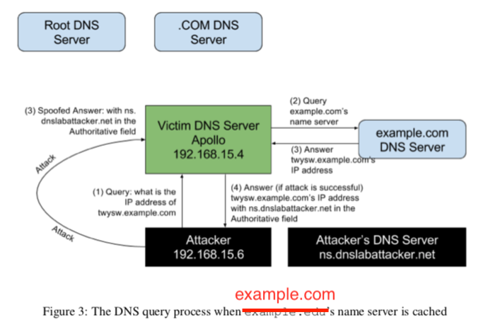
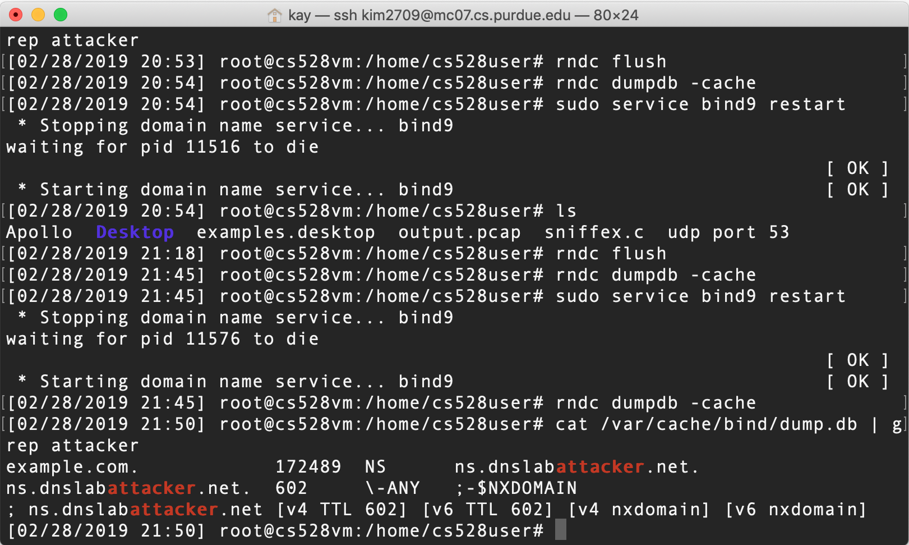
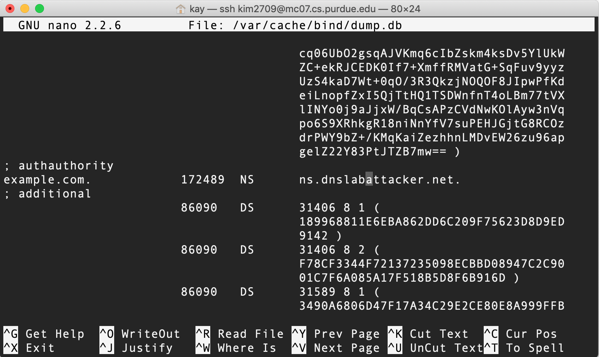
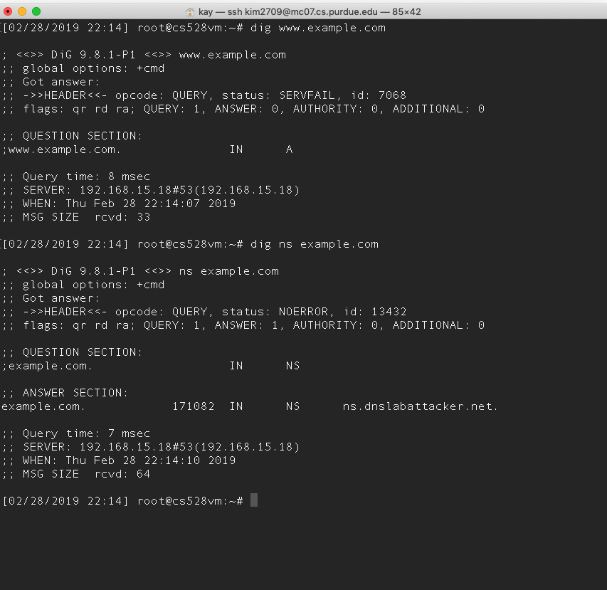
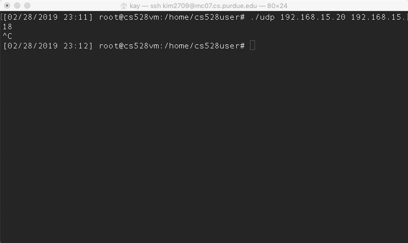
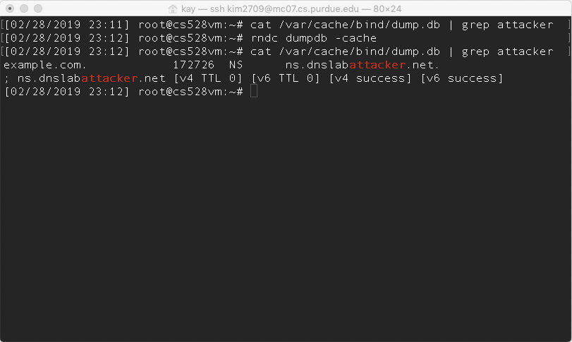
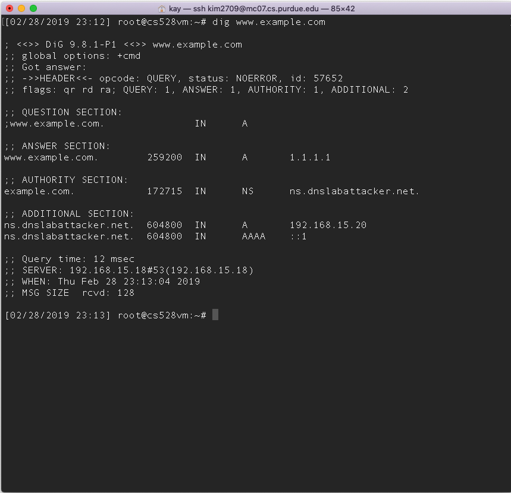

## Lab2: Remote DNS Cache Poisoning Attack Lab (Due: Feb 28th)

### Introduction

This project provides first-hand experience on the remote DNS cache poisoning attack, or Kaminsky DNS attack. In the project, we're allowed to simultaneously run three virtual machines on a network. The three virtual machines play a role of DNS server, user, and attacker respectively. Kamingsky DNS attack is implemented as follows:


For my machine, DNS server is 198.165.15.18, user is 198.165.15.19, and attacker is 198.165.15.20.

1. The attacker queries the DNS server Apollo for a non-existing name in example.com, such as "aaaaa.example.com", where aaaaa is a random name.
2. Since the mapping is unavailable in Apollo's DNS cache, Apollo sends a DNS query to the name server of the example.com domain.
3. While Apollo waits for the reply, the attacker floods Apollo with a stream of spoofed DNS response, each trying a different transaction ID, hoping one is correct.
4. Even if the spoofed DNS response fails, it doesn't matter, because the next time, the attacker will query a different name, so Apollo has to send out another query, giving the attack another chance to do the spoofing attack. This effectively defeats the caching effect.
5. If the attack succeeds, in Apollo's DNS cache, the name server for example.com will be replaced by the attacker's name server "ns.dnslabattacker.net".


### Task1: Remote Cache Poisoning

1. Implementation
	- Send a DNS query to Apollo for a random host name in the example.com domain. The host name must be a non-existing name such as aaaaa.example.com. 
	- Predict the random ID range, where the authentic ID will be, genereated by the resolver: transaction IDs are between 22800 and 22900 sooner or later
	- Forge 100 DNS response packets with random IDs within the range, and send to Apollo all the packets in a very short time window before the server receives the authentic response to the query.
	- One of the bogus packets hits the correct transaction ID, and then the attack's successfully done.
	- Repeat the above steps until this attack's successfully complete: different random host names and the same ID range.
	
2. Result
	- ns.dnslabattacker.net is observed in the server's cache so the attack was successful.
	- Below are the pictures that proov the server's poisoned.





<br />

### Task2: Result Verification

I dig "www.example.com" on the user VM in order to verify Kaminsky DNS attack is indeed successful. However it turns out the attack is incomplete. Look at the picture below: 



When the DNS server receives the DNS query, it searches for example.com's NS record in its cache, and finds "ns.dnslabattacker.net". It will therefore send a DNS query to "ns.dnslabattacker.net". But, before sending the query, the server needs to know the IP address of "ns.dnslabattacker.net". A seperate DNS query is issued, and then the DNS server finds out the domain name "dnslabattacker.net" doesn't exist. The server shortly marks the NS entry invalid. 

You may say "Hey, include an additional record for the IP address for "ns.dnslabattacker.net" when forging the DNS response". Unfortunately, an IP address for the name server "ns.dnslabattacker.net" cannot be provided even if you actually attach it as an additional record in your spoofed response. Bailiwick checking plays a role of ignorning any records that are not within the same domain of the question. Hence "ns.dnslabattacker.net" cannot be answered in the additional section.


In this project, we can luckily handle this issue by simply adding some codes on both the Server and Attacker. Specifically, we store this IP address within resolver's name zone.

**1. Apollo (DNS server)**
- sudo su
- cd /etc/bind/
- nano -c named.conf.default-zones
- add the following codes:
```c
 zone "ns.dnslabattacker.net" {
                type master;
                file "/etc/bind/db.attacker";
};
```
- nano -c db.attacker
- add the following codes:
```c
$TTL 604800
@ IN SOA localhost. root.localhost. (
		2; Serial
		604800 ; Refresh
		86400 ; Retry
		2419200 ; Expire
		604800 ) ; Negative Cache TTL;
@ IN NS ns.dnslabattacker.net.
@ IN A 192.168.15.20
@ IN AAAA ::1
```

**2.DNS_attacker (attacker)**
- sudo su
- cd /etc/bind/
- nano -c named.conf.local
- add the following entry:
```c
zone "example.com" {
	type master;
	file "/etc/bind/example.com.db";
};
```
- nano -c example.com.db
- add the following codes:
```c
$TTL 3D
@		IN		SOA ns.example.com. admin.example.com. (
		2008111001	
		8H
		2H
		4W
		1D)
@		IN	NS	ns.dnslabattacker.net.
@		IN	MX	10 mail.example.com.
www		IN	A	1.1.1.1
mail		IN	A	1.1.1.2
*.example.com.	IN	A	1.1.1.100
```

**3. Apollo and DNS_attacker**
- restart both Apollo and DNS_attacker's DNS servers; otherwise, the modification will not take effect.

**4. DNS_attacker**
- sudo su
- ./udp 192.168.15.20 192.168.15.18
- The first argument is your dns_attacker IP address. The second argument is your Apollo IP address.
- Keep it running. Do not forcefully shut down until your attack's confirmed successful on the DNS server.
- Below is the image to help understanding:


**5. Apollo**
- sudo su
- rndc dumpdb -cache (or rndc -cache dumpdb)
	- The above command is for dumping bind's cache into /var/cache/bind/dump.db where you set up in /etc/bind/named.conf.options when configuring the local DNS server Apollo. 
- cat var/cache/bind/dump.db | grep attacker
	- This is for catching a line that contains the word, attacker. If your poisoning attack was successful, then your malicious name server, "ns.dnslabattacker.net", would be injected in the file; otherwise your attack failed, and nothing would appear.
- Below is the image to help understanding:


**6. DNS_user**
- dig www.example.com in order to make sure your attack's indeed successful.
- Below is the image to help understanding:

