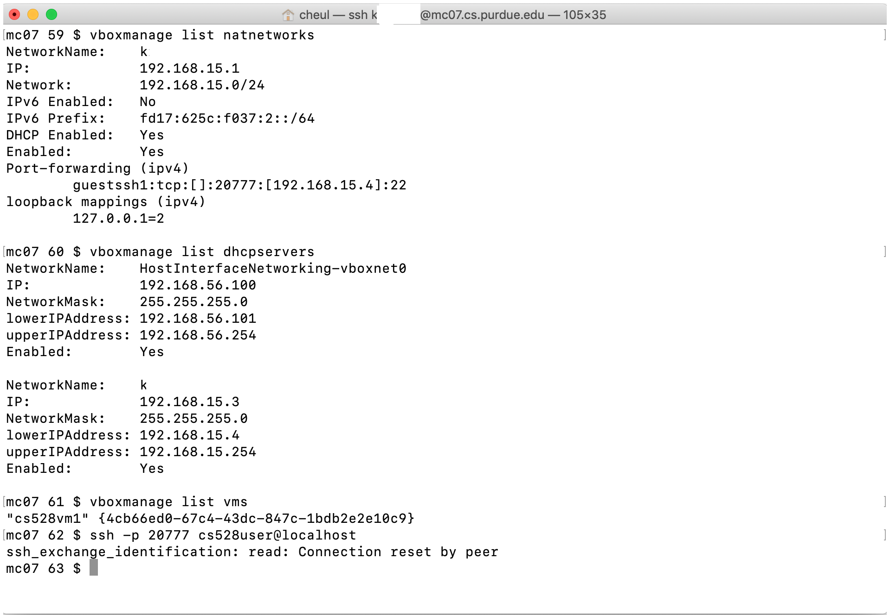
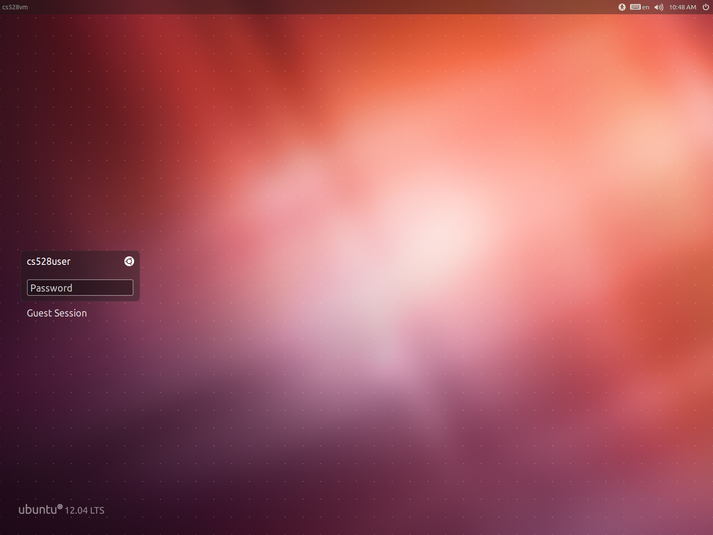
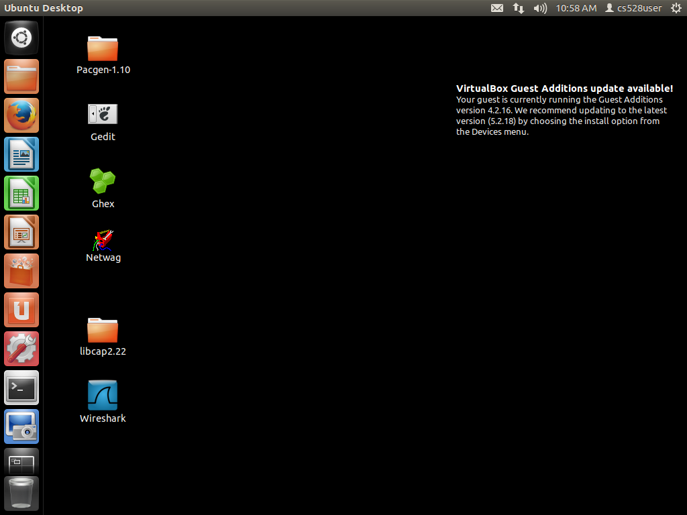
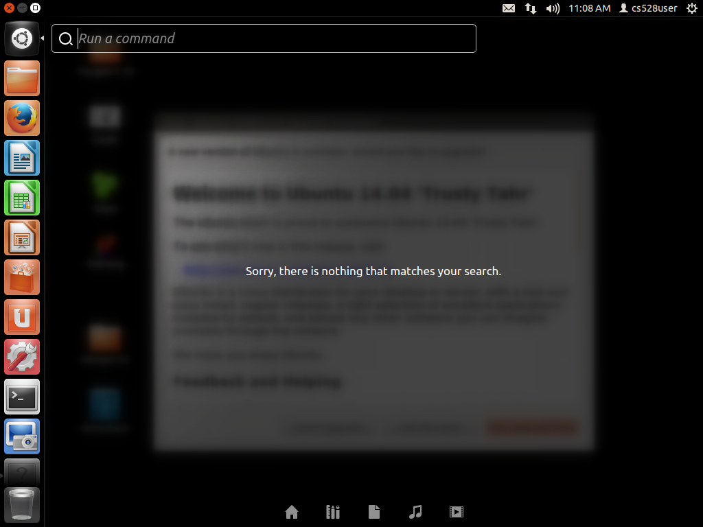
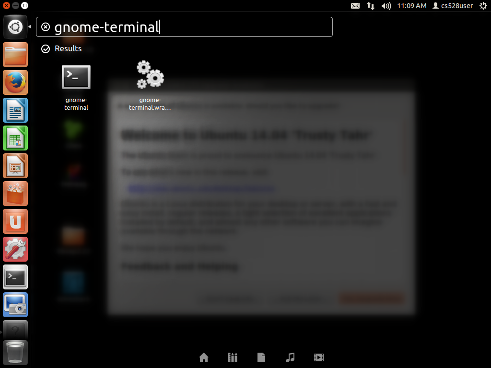
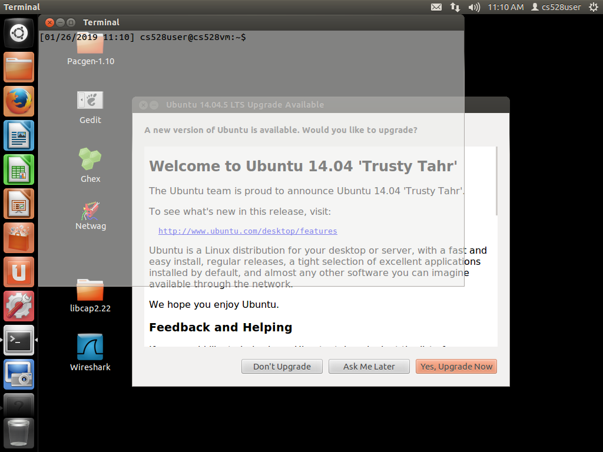
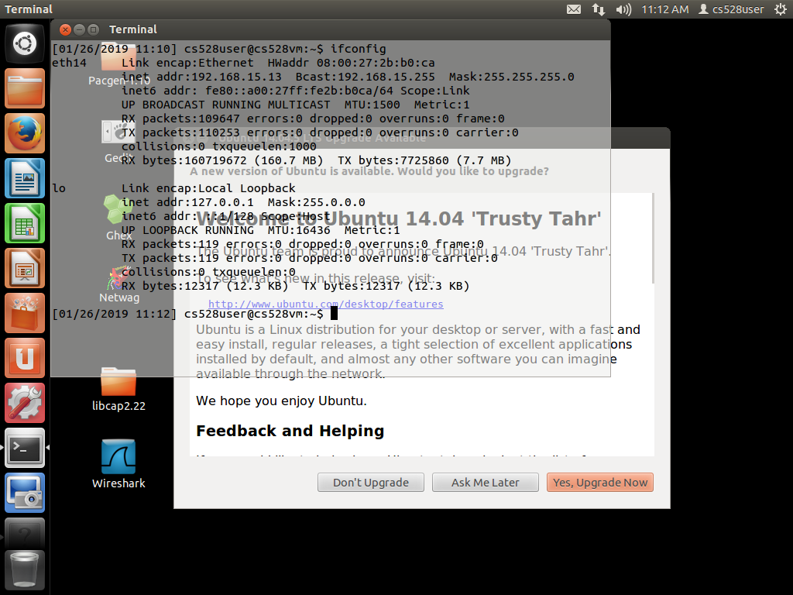
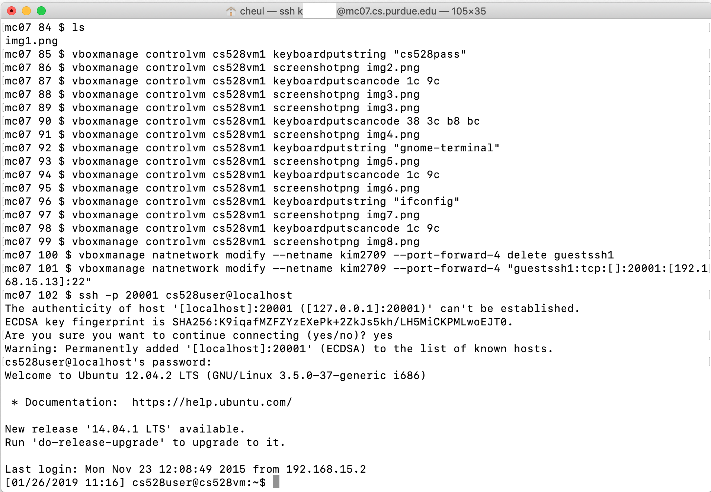

#EDITING...
## Trouble Shoot: ssh_exchange_identification: read: Connection reset by peer

Every step you've made during the setup phase is clean and smooth. But you might run into a login issue at the end, which is "ssh_exchange identification: read: Connection reset by peer" (Image below)

<table>
  <tr>
    <td>  </td>
  </tr>
</table>

Connecting to the wrong IP would be a reason. The IP leases do not start over from 192.168.15.4 when you create a new network for your virtual machine. This is because the VBox Manager DHCP server will continute assiging IP address in sequential ascending order. How can we find the address from 192.168.154.4 to 192.168.154.255?

Try
>VBoxManage guestproperty get [VMNAME] "/VirtualBox/GuestInfo/Net/0/V4/IP" 

to find your IP address of your virtual machine.

If you got a message: "No Value Set", chances are that your virtual machine never made it through boot. So your virtual machine has not done any DHCP requests/discovery, providing no IP number. Try to boot in display mode and see whether or not you get to the login prompt on your VM machine screen. If yes, then log in it, run Terimnal, and type "ifconfig" to find out the acutal IP address.

If your server doens't provide the virtualbox GUI, then here are some tools for troubleshooting.
1. VBoxManage controlvm [VMNAME] screenshotpng [IMGNAME]
2. VBoxManage controlvm [VMNAME] keyboardputstring [STRING]
3. VBoxManage controlvm [VMNAME] keyboadputscancode [HEXCODE]

And here are screenshots in using the tools.\
First of all, screenshot your virtual machine to see its current state.
> VBoxManage controlvm [VMNAME] screenshotpng img1.png
<table>
  <tr>
    <td>  </td>
  </tr>
</table>
Open img1.png by using a graphical tool on your server; I downloaded the PNG file and opened it on local.

<table>
  <tr>
    <td>  </td>
    <img1.png>
  </tr>
</table>

If the opened img1.png looks like the above image, then send your password to your virtual machine.

> VBoxManage controlvm [VMNAME] keyboardputstring [PASSWORD]

<table>
  <tr>
    <td>  </td>
  </tr>
</table>

Send "enter" to your virtual machine so you're logged in.
> VBoxManage controlvm [VMNAME] keyscancode 1c 9c

"1c 9c" is equivalent to "Press and Hold Enter(1c), and Relase it(9C)" \
For any further information, check this website: https://www.win.tue.nl/~aeb/linux/kbd/scancodes-1.html

<table>
  <tr>
    <td>  </td>
  </tr>
</table>

<table>
  <tr>
    <td>  </td>
  </tr>
</table>

<table>
  <tr>
    <td>  </td>
  </tr>
</table>

<table>
  <tr>
    <td>  </td>
  </tr>
</table>

<table>
  <tr>
    <td>  </td>
  </tr>
</table>

<table>
  <tr>
    <td>  </td>
  </tr>
</table>

<table>
  <tr>
    <td>  </td>
  </tr>
</table>
