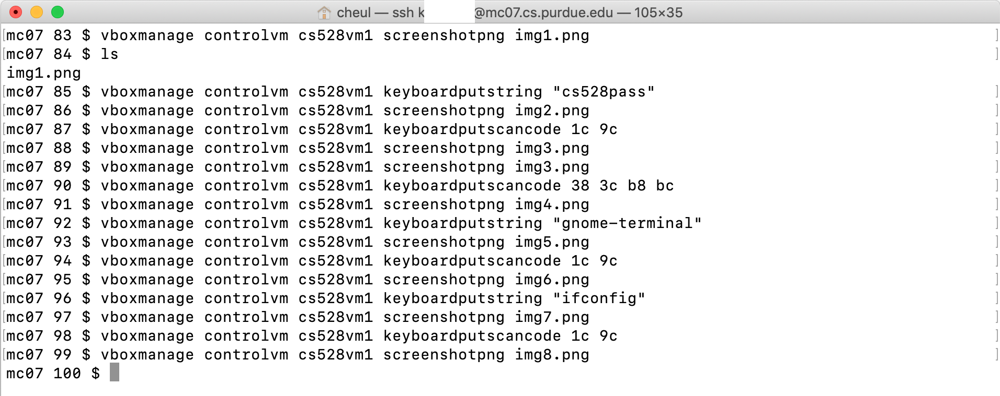

#EDITING...
## Trouble Shoot: ssh_exchange_identification: read: Connection reset by peer

Every step you've made during the setup phase is clean and smooth. But you might run into a login issue at the end, which is "ssh_exchange identification: read: Connection reset by peer" (Image below)

<table><tr>
  <td>  </td>
  </tr>
</table>

Connecting to the wrong IP would be a reason. The IP leases do not start over from 192.168.15.4 when you create a new network for your virtual machine. This is because the VBox Manager DHCP server will continute assiging IP address in sequential ascending order. How can we find the address from 192.168.154.4 to 192.168.154.255?

Try
>VBoxManage guestproperty get [VMNAME] "/VirtualBox/GuestInfo/Net/0/V4/IP" 

to find your IP address of your virtual machine.

If you got a message: "No Value Set", chances are that your virtual machine never made it through boot. So your virtual machine has not done any DHCP requests/discovery, providing no IP number. Try to boot in display mode and see whether or not you get to the login prompt on your VM machine screen. If yes, then log in it, run Terimnal, and type "ifconfig" to find out the acutal IP address you're assigned. 

If your server doens't provide the virtualbox GUI, then here are some tools for troubleshooting.
1) VBoxManage controlvm [VMNAME] screenshotpng [IMGNAME]
2) VBoxManage controlvm [VMNAME] keyboardputstring [STRING]
3) VBoxManage controlvm [VMNAME] keyboadputscancode [HEXCODE]

And here are examples in using the tools.

<table><tr>connecting
  <td>  </td>
  </tr>
</table>

<table><tr>
  <td>  </td>
  </tr>
</table>

<table><tr>
  <td>  </td>
  </tr>
</table>

<table><tr>
  <td>  </td>
  </tr>
</table>

